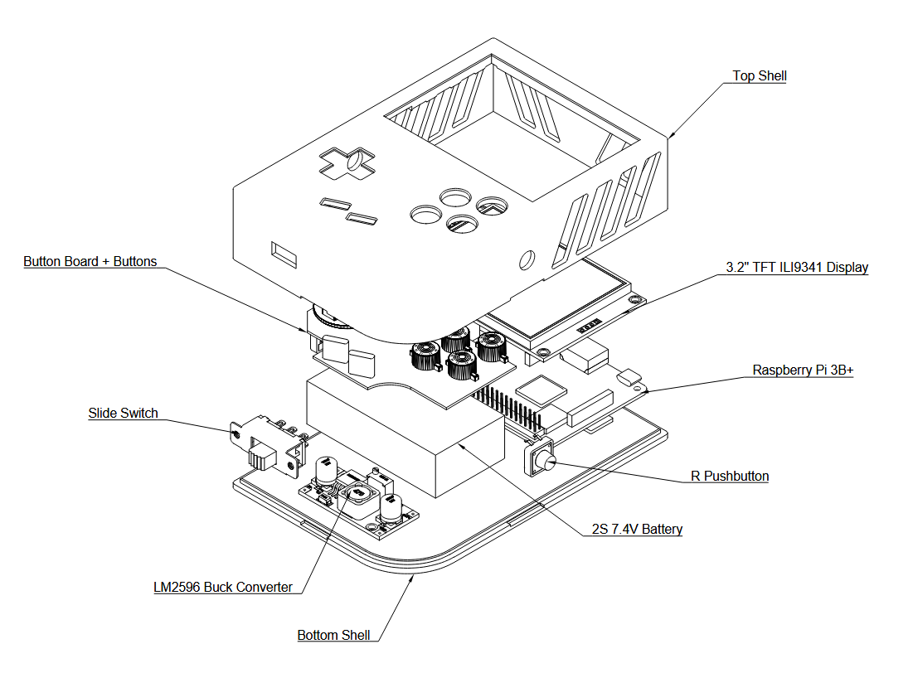
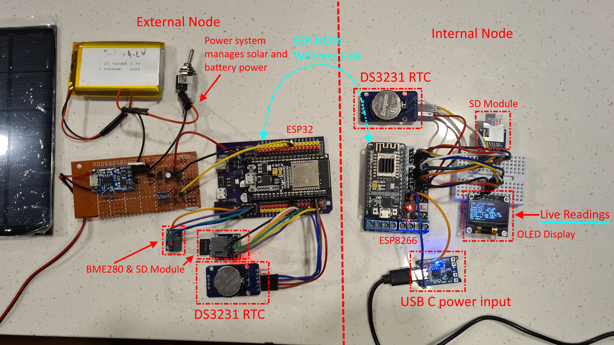

# Hey, I'm Raaghav Batra! 💥💥💥🦅🦅🦅

Welcome to my GitHub profile! I'm a passionate mechatronics engineering student and a maker who loves building innovative solutions and sharing my projects with the world.

Here are some of my favorite projects:
## Featured Projects

### [RetroPie Portable Gaming Console](https://github.com/rbat05/RetroPieGameboy)
A Raspberry Pi 3B+ Game Boy‑style build for plug‑and‑play retro gaming.

- **Features:**
  - Emulates systems up to the PlayStation 1 era
  - Custom 3D-printed Game Boy-inspired chassis
  - Active thermal management with dual fans
  - Fully open source under the GNU General Public License v3.0

  

---

### [Solar Weather Station](https://github.com/rbat05/SolarWeatherStation)
A solar-powered weather station with an indoor head unit and a web server for displaying real-time weather data.

- **Features:**
  - Solar-battery hybrid system for uninterrupted operation
  - Real-time weather data on OLED display and web server
  - Modular design with efficient communication using ESPNOW
  - Historical data tracking and analysis with daily CSV logs

  

---

## 🌟 About Me

- 🔭 I’m currently working on **innovative hardware and software projects**
- 🌱 I’m currently learning **advanced IoT systems and embedded programming**
- 💬 Ask me about **Raspberry Pi, ESP32, and 3D printing**

## 🌐 Connect with Me

I am always open to new ideas and collaborations. Feel free to [reach out](https://www.linkedin.com/in/raaghav-batra-73405b317/) if you have any questions, suggestions, or just want to chat about technology!

